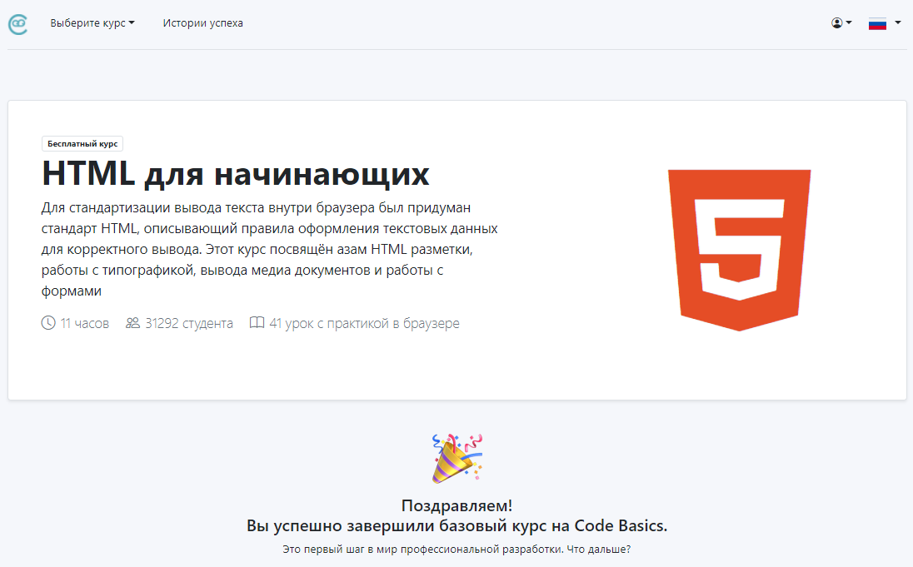
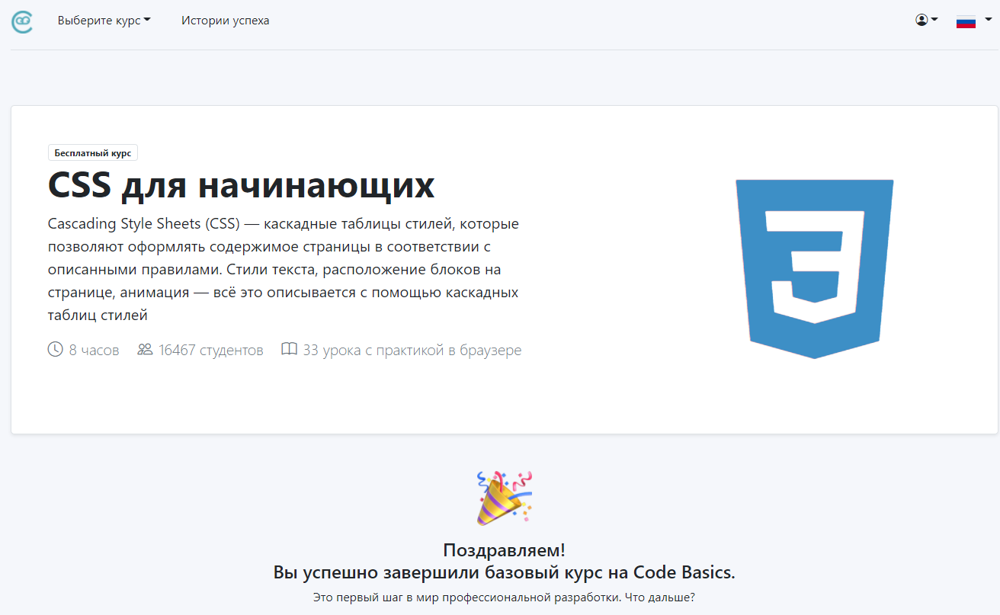

# Maria Merzhanova

## Contacts

- Location: Moscow, Russia
- email: merzhanova@gmail.com
- Discord: maria.k.m

## Skills

- HTML5, CSS3
- JavaScript Basics
- Git, GitHub
- VS Code
- Adobe Photoshop
- Python Basics

## Education

- [MIREA - Russian Technological University](https://english.mirea.ru/)
- [HTML для начинающих: https://ru.code-basics.com/languages/html](https://ru.code-basics.com/languages/html)
  
- [CSS для начинающих: https://ru.code-basics.com/languages/css](https://ru.code-basics.com/languages/css)
  

## Code example

JavaScript:

```
function multiply(a, b){
  return (a * b);
};
```

Python code:

```
table = 7

for i in range(1, 13):
  mult = i*table
  #print(mult)
  print('Please multiple',  i ,  '*' , table , ': ')
  result_answer = (input(''))

  ###check the user enter the word "stop":
  if result_answer != 'stop':
    ### check the numeric:
    if result_answer.isnumeric() == False:
      print('Please enter a numeric: ')
      result_answer = int(input(''))

    ###convert string to interger:
    result_answer = int(result_answer)

    ###check not correct answer and ask again:
    if result_answer != mult:
      print('mistake, try again: ')
      result_answer = int(input(''))
    else:
      continue     #go to next cycle

  ###user enter "stop"
  else:
    break

#print('Congratulations!!!')
print('End')
```

## Languages

- English - B1
- Russian - Native
- Spanish - A2